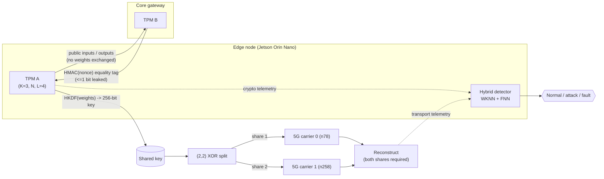

# PostQuantumEdge

**A reproducible framework for post-quantum edge communication: a hybrid
**ML-KEM (FIPS 203) + Tree-Parity-Machine** key establishment, **tunable $(T,N)$**
5G multi-carrier secret sharing, and a cross-modal WKNN–FNN anomaly detector —
integrated with defence-in-depth and full observability.**

> Prepared for submission to **IEEE ANTS 2026**, track *Machine Learning and
> Optimization for Networked Systems*. The paper is double-blind; see `paper/`.

> ### Read this first — scientific-integrity statement
> The post-quantum guarantee in this framework comes **entirely from ML-KEM**
> (NIST FIPS 203), an IND-CCA2 KEM based on Module-LWE. Tree-Parity-Machine (TPM)
> neural key agreement is **not** a proven post-quantum primitive — it is defeated
> by known geometric, genetic, and majority attacks (Klimov–Mityagin–Shamir 2002;
> Ruttor 2006; Shacham 2004). **We make no claim that TPM is quantum-resistant.**
> TPM is kept only as **defence-in-depth / auxiliary entropy** inside a NIST
> SP 800-56C-style concatenation KDF, so the session key is no weaker than ML-KEM
> alone. Our head-to-head benchmark shows ML-KEM is *both faster and proven*; TPM's
> only measurable advantage is a tiny wire footprint. The framework's real
> contributions are (a) the honest hybrid anchoring, (b) a privacy-preserving
> early-termination protocol for the TPM step, (c) tunable $(T,N)$ secret sharing
> across carriers, and (d) cross-modal learning that makes *active* attacks
> observable — where **fusion, not classifier choice, is decisive**. This honesty
> is the point of the project, not a caveat bolted on.

---

## A. Research design

### A.1 Gap analysis
The neural-cryptography literature has a recurring problem: TPM key exchange is
frequently presented as a quantum-resistant primitive, even though its
cryptanalysis is well established and it offers **no** reduction to a hard
problem. Two real gaps remain, and we target *those* rather than the overstated
security claim:

1. **Operational honesty.** Attacker success is often reported as an optimistic
   *best-of-N* overlap. The decision-relevant quantity is whether the adversary's
   *actual* key guess (e.g. an ensemble's majority vote) recovers the key. We
   report the operational rate and keep best-of-N only as a diagnostic bound.
2. **Systems integration & observability.** TPM studies rarely connect the
   primitive to a transport layer or to runtime detection. A constrained edge
   node needs *graceful degradation* and *detectability*, not a single brittle
   primitive.

### A.2 Novel contributions
- **Privacy-preserving, rate-limited early termination** for TPM synchronization:
  stop from a *public* confidence signal (windowed agreement rate + streak), then
  confirm equality with an HMAC over a public nonce (leaks ≤ 1 bit), rate-limited
  to bound verification messages. → ~$6\times$ fewer verification messages.
- **Honest empirical security characterization** vs. TPM size $N$, using the
  operational (majority-vote) eavesdropper.
- **Behavioural $(2,2)$ split-bearer transport** over two 5G carriers with an
  explicit, quantified confidentiality–availability trade-off.
- **Hybrid WKNN–FNN detector** fusing cryptographic + transport telemetry; an
  ablation shows *neither modality alone suffices*.
- **A complete, runnable artifact**: grounded data generator, experiments /
  ablations / sweeps, publication figures, and a Jetson Orin Nano deployment
  path.

### A.3 Research questions
- **RQ1** — Does privacy-preserving early termination reduce synchronization
  overhead without harming key agreement?
- **RQ2** — How does the *operational* eavesdropper's key-recovery rate vary with
  TPM size, and is a single small TPM safe?
- **RQ3** — What is the availability cost of $(2,2)$ bifurcation relative to its
  confidentiality benefit?
- **RQ4** — Can a learning-based detector separate cryptographic attacks from
  network faults, and is cross-modal feature fusion necessary?

### A.4 Hypotheses
- **H1** — Confidence-gated, rate-limited verification reduces verification
  messages and rounds vs. fixed-interval verification, at equal key agreement.
  *(Supported: ~11 → ~2 verifications, 100% key agreement.)*
- **H2** — Operational eavesdropper success decreases as $N$ grows; a single
  $K{=}3$ TPM is *not* safe. *(Supported: geometric attacker succeeds with
  non-negligible probability at small $N$.)*
- **H3** — $(2,2)$ bifurcation lowers availability vs. a single carrier.
  *(Supported: e.g. $0.66 \to 0.44$ at $p{=}0.05$, 8 PDUs/share.)*
- **H4** — Fusion of cryptographic and transport telemetry outperforms either
  alone. *(Supported: ~0.40 / ~0.49 alone vs. ~0.91 fused, macro-F1.)*

### A.5 Threat model & assumptions
- **Adversary:** Dolev–Yao — observes all public messages; may inject/probe. For
  key recovery it runs its own TPM(s) with the geometric correction, optionally
  as a majority-vote ensemble.
- **Key assumption (stated, not hidden):** a purely **passive** eavesdropper
  leaves **no** host-side artifact and is therefore **undetectable** by the
  telemetry detector. Attack classes are modelled as **active** (injecting /
  probing), which perturb observable signals. Detection complements, and does not
  replace, cryptographic hardening.
- **Trust:** endpoints are honest; the public channel is authenticated against
  trivial spoofing at the network layer (3GPP TS 33.501 context).

### A.6 Architecture

*Eavesdropper E (not shown) runs its own TPM(s) against the public channel; a
passive E is by assumption invisible to DET.*

---

## Repository layout
```
neural_crypto/     TPM, attacks (geometric/majority), sync protocol, security metrics
pqc/               ML-KEM (FIPS 203) wrapper + hybrid SP 800-56C concatenation KDF
bifurcation/       XOR (2,2) + tunable (T,N) Shamir sharing over GF(2^8),
                   PDCP split-bearer carriers, reliability/availability analysis
anomaly_detector/  features, WKNN, FNN, hybrid, explainability, evaluation+figures
common/            seeding, config I/O, hashing/HKDF, privacy-preserving equality tag
data_generator/    grounded telemetry generator + 5G-NIDD loader/adapter
experiments/       run_all (5 configs), ablation, sweep (incl. (T,N)), baselines+significance
scripts/           make_figures, make_tables, benchmark_pqc, benchmark_tpm, run_pipeline.sh
deployment/        Dockerfiles, compose, TensorRT, monitoring (Prometheus/Grafana), power, modem guide
paper/             IEEEtran main.tex, references.bib, generated figures/ and tables/
configs/           YAML reference operating points
results/, figures/, datasets/   generated outputs
```

## Installation
```bash
python -m venv .venv && source .venv/bin/activate
pip install torch --index-url https://download.pytorch.org/whl/cpu   # or Jetson wheel
pip install -r requirements.txt
pip install -e .          # optional: console entry points
```
Python ≥ 3.10. Core deps: numpy, scipy, scikit-learn, matplotlib, pandas, PyYAML,
torch. (ONNX/TensorRT are optional, for deployment only.)

## Quickstart — reproduce everything
```bash
# Fast smoke run (a couple of minutes):
bash scripts/run_pipeline.sh quick
# Full run (paper-scale numbers):
bash scripts/run_pipeline.sh full
```
Or step by step:
```bash
python data_generator/generate_dataset.py --n-per-class 1200 --tpm-N 100 --seed 7
python experiments/run_all.py   --n-sessions 50 --tpm-N 100 --fnn-epochs 120
python experiments/sweep.py     --N-values 40 60 80 100 --fnn-epochs 120   # incl. (T,N)
python experiments/ablation.py  --tpm-N 100 --fnn-epochs 120
python experiments/baselines.py --seeds 0 1 2 3 4 --fnn-epochs 120         # + McNemar
python scripts/benchmark_pqc.py --iters 200 --tpm-N 100                    # ML-KEM vs TPM
python scripts/benchmark_tpm.py --N 100
python scripts/make_figures.py  --tpm-N 100 --fnn-epochs 120
python scripts/make_tables.py
```
To validate the detector on the **real 5G-NIDD** dataset (download separately from
IEEE DataPort; not redistributed here):
```bash
python data_generator/load_5g_nidd.py /path/to/5g-nidd.csv --augment-crypto
python experiments/baselines.py --dataset datasets/fivegnidd.csv
```
Outputs: `results/*.csv|json`, `figures/*.png`, `paper/figures/*.png`,
`paper/tables/*.tex`.

## What was actually executed & verified (representative)
Numbers below are from a CPU run in this repository (seeded; small run-to-run
variation is expected). They are reproduced by the commands above.

| Result | Value |
|---|---|
| TPM synchronization (K=3, N=100), key agreement | 100% |
| Early termination: verification messages (hash-only → early) | ~11 → ~2 |
| Geometric (single) eavesdropper success @ K=3 | non-negligible (≈0.3–0.6, ↓ with N) |
| Majority-ensemble operational key recovery @ K=3 | ~0 (high but sub-threshold overlap) |
| **Key establishment (CPU): ML-KEM-512/768/1024 establish** | ~8.7 / ~13.3 / ~19.3 ms (proof: yes) |
| **Key establishment: TPM(K=3,N=100)** | ~58 ms, **65 B wire** (proof: no) |
| **Hybrid ML-KEM-768 + TPM (inherits ML-KEM guarantee)** | ~76 ms |
| **ML-KEM wire footprint (768): pubkey / ciphertext / secret** | 1184 B / 1088 B / 32 B |
| $(2,2)$ availability @ p=0.05, 8 PDUs/share (single → (2,2) → dup) | ~0.66 → ~0.44 → ~0.89 |
| **Tunable $(T,N)$ availability, N=5 @ p=0.05: (1,5)→(5,5)** | 0.996 / 0.953 / 0.785 / 0.455 / 0.129 |
| Detector macro-F1 (hybrid), ROC-AUC | ~0.91, ~0.98 |
| Detector: crypto-only / transport-only / fused macro-F1 | ~0.40 / ~0.49 / ~0.91 |
| **Baselines (RF/SVM/GB/LogReg) vs hybrid macro-F1** | all ~0.89–0.90; McNemar p≈1.0 (not significant) |
| TPM cost (CPU): ms/round, mean session | ~0.09 ms, ~90 ms |

> **Headline (honest):** ML-KEM is faster *and* proven; TPM's sole edge is wire
> footprint, so it survives only as auxiliary entropy. On detection, *cross-modal
> fusion* drives the result (0.40/0.49 → 0.91) — the classifier barely matters.

## Deployment
See [`deployment/README.md`](deployment/README.md) for Jetson Orin Nano bring-up,
the ONNX→TensorRT path, the Prometheus/Grafana monitoring stack, `nvpmodel`
power profiles, and dual-modem (Quectel RM520N-GL / SIMCom SIM8202G-M2)
multi-carrier transport. **This path is a documented prototype and is not
hardware-validated in this artifact.**

## Paper
`paper/main.tex` is IEEEtran conference format and compiles on Overleaf
(which provides `IEEEtran.cls`) or any TeX Live with `texlive-publishers`. It
`\input{}`s the generated tables and includes the generated figures, so it stays
numerically consistent with `results/`. We deliberately ship neither
`IEEEtran.cls` (provided by Overleaf) nor a vendored copy.

## Consolidated limitations
1. **The post-quantum guarantee is ML-KEM's, not TPM's**; TPM is broken by known
   attacks and is defence-in-depth only.
2. **Passive eavesdroppers are undetectable** from the host channel (by design).
3. **Higher confidentiality costs availability** in the $(T,N)$ scheme — no free
   lunch on a lossy link; pick the operating point deliberately.
4. **Detector main results use grounded synthetic telemetry**; the 5G-NIDD path
   needs augmented cryptographic features (semi-synthetic) because that dataset is
   transport-only.
5. **ML-KEM timings are from a pure-Python reference** (relative only); on-device
   numbers need an optimized library (liboqs/pqm4) on the Jetson.
6. **Jetson/TensorRT/modem path is an unvalidated prototype**; true path
   independence needs two modems/operators.

## References (used in the paper; not fabricated)
Kanter–Kinzel–Kanter (EPL 2002); Rosen-Zvi et al. (PRE 2002);
Klimov–Mityagin–Shamir (ASIACRYPT 2002); Ruttor (PhD thesis 2006);
Shamir (CACM 1979); Dolev–Yao (IEEE TIT 1983); Cover–Hart (IEEE TIT 1967);
LeCun–Bengio–Hinton (Nature 2015); NIST FIPS 203 / IR 8413; 3GPP TS 38.323 /
33.501; Shor (SICOMP 1997); Hastie–Tibshirani–Friedman (2009).

## License
MIT (see `LICENSE`). The IEEE template class is **not** included; obtain it via
Overleaf or your TeX distribution.
